# World_Layoffs_Dataset
SQL analysis of global layoffs, exploring trends by company, industry, company stage, and geography using MySQL.

## Executive Summary
To be unpdated after the analysis is complated

## Dataset Overview

The dataset covers global layoff events from 2020 to 2023, a period 
where many companies across different industries were affected by the 
COVID-19 pandemic and economic uncertainty. It includes information 
on the company, location, industry, funding stage, and how many 
employees were laid off.

However, since the dataset does not show the total number of employees,
percentage_laid_off is not really relevant because we cannot get the total 
number of employees for each company.

| Column | Description |
|---|---|
| `company` | Name of the company |
| `location` | City where the company is based |
| `industry` | Industry the company belongs to |
| `total_laid_off` | Number of employees laid off |
| `percentage_laid_off` | Percentage of workforce laid off |
| `date` | Date of the layoff event |
| `stage` | Company growth stage |
| `country` | Country where the company is based |
| `funds_raised_millions` | Total funds raised in millions |

## Analysis & Findings

### Layoffs by Company

The table below shows companies ranked by the highest number of 
employees laid off in a single event.

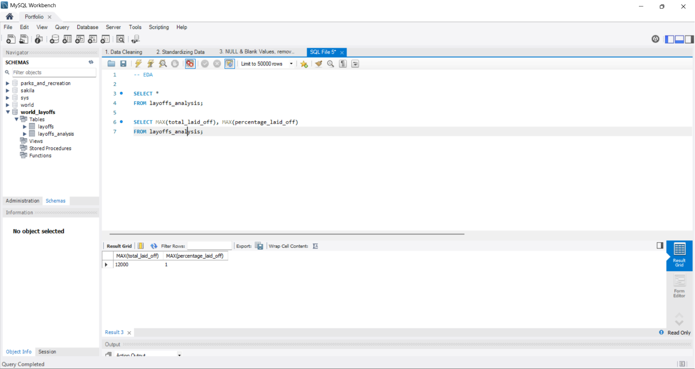

Google leads with the highest single layoff event at **12,000** 
employees, followed by Meta at **11,000** and Amazon appearing 
twice with **10,000** and **8,000** employees laid off in separate 
events. Most of the top companies are large tech firms, suggesting 
that despite their scale, they were not immune to workforce reductions 
during this period.

### Layoffs Period

The table below shows the time period covered in this dataset.

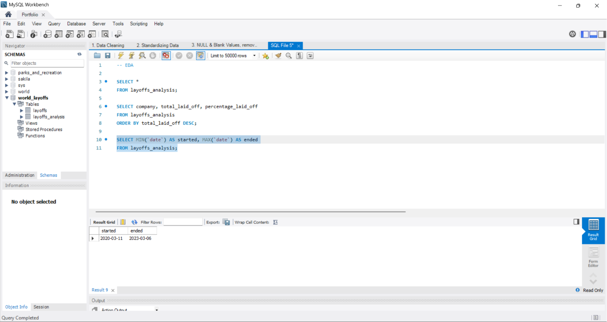

The earliest layoff recorded was on **2020-03-11** and the most recent 
was on **2023-03-06**. This confirms that the dataset covers the 
COVID-19 era, a period where many companies were forced to reduce 
their workforce due to economic uncertainty.

### Total Layoffs by Companies

Previously, we can see that some companies had more than one layoff 
event. The table below shows the total layoffs for each company.

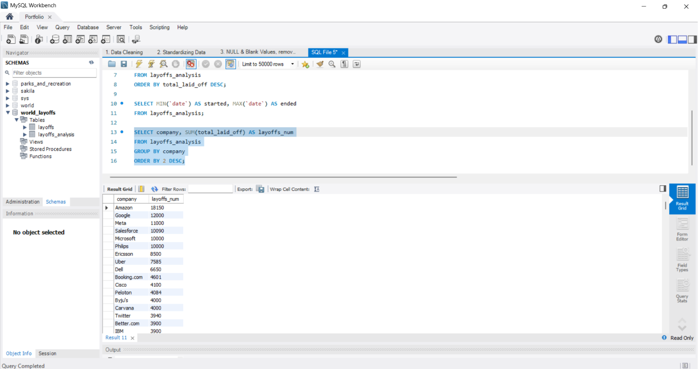

From the previous table, Amazon appeared twice in layoff events. 
Looking at the total, Amazon laid off **18,150** employees in total, 
making it the highest among all companies. Google comes second with 
**12,000** and Meta at third with **11,000**. Not far behind are 
Salesforce, Microsoft and Philips with around **10,000** each.

### Total Layoffs by Industry

The table below shows the total number of layoffs by industry.

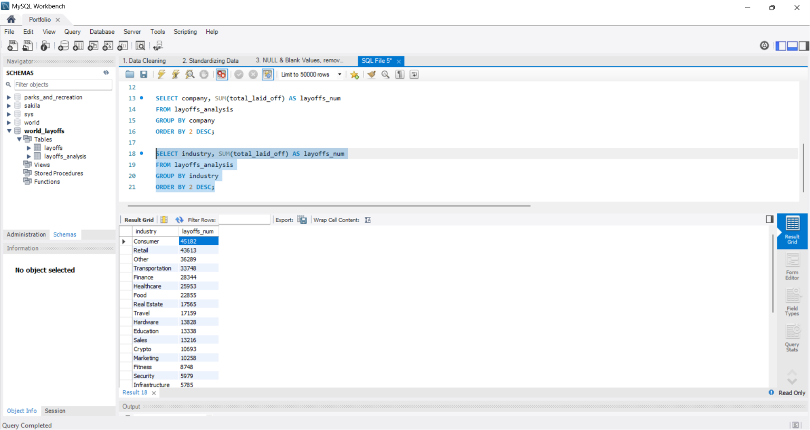

Consumer industry has the most layoffs with **45,182** employees affected. 
This makes sense since the top three companies with the highest layoffs, 
Amazon, Google and Meta, all come from the Consumer industry. Retail 
comes in second with **43,613**, not far behind. The Other category 
comes after with **36,289**.

## Recommendations

## Raw Data
- Below is a screenshot of raw data
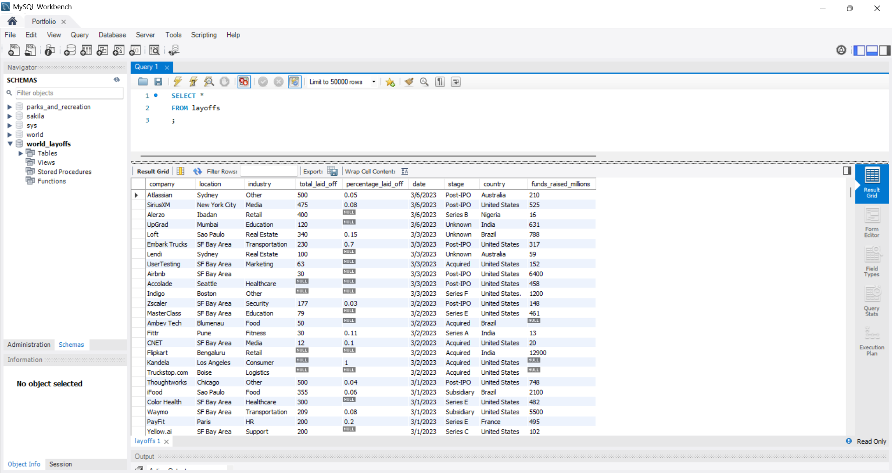

## Data Cleaning

### 1. Remove Duplicates

Since the dataset does not have a unique identifier, I needed to 
find another way to detect duplicates. Here is what I did:

- Created a staging table called `layoffs_analysis` to work on, 
  keeping the raw data untouched
- Used `ROW_NUMBER()` to flag duplicates by partitioning records 
  that share the same company, location, industry, total_laid_off, 
  date, stage, country, and funds_raised_millions
- Any record that appears more than once gets a row number greater 
  than 1 and those are the duplicates
- Deleted all records where row number is greater than 1
- After deleting, I ran the same query to check if any duplicates still exist. No results means the duplicates were successfully removed.
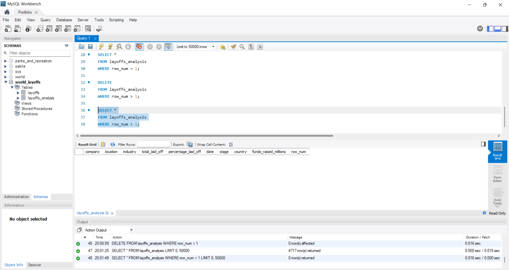

### 2. Standardizing Data

Checking data types is an important step before doing any analysis. 
ost of the time, raw data captures the `date` column as text instead 
of a proper date format, so that needs to be fixed. Here is what I did:

- Trimmed all text columns to remove any leading or trailing spaces 
  that could affect the analysis
- Some columns had inconsistent spellings for the same value, for 
  example `Crypto`, `Cryptocurrency` and `Crypto Currency` all refer 
  to the same industry. I standardized these so the data is consistent 
  and accurate
  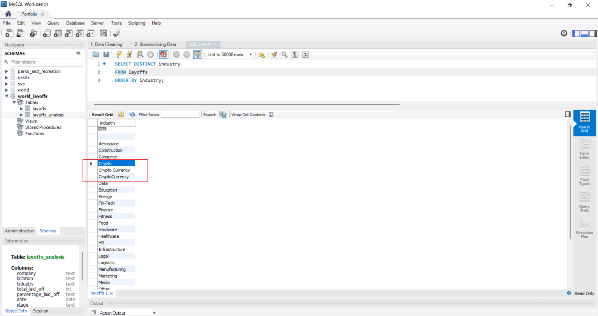
  *Before: Industry column with inconsistent spellings*
  
  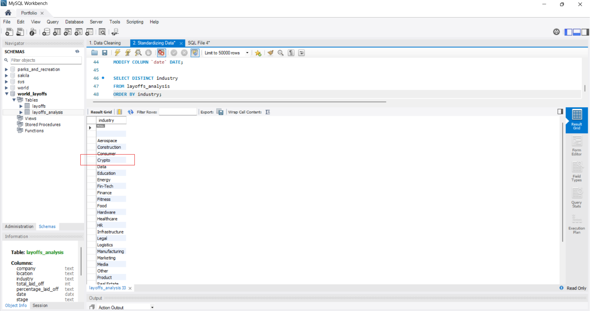
  *After: Standardized to a single value*
  
- Converted the `date` column from text to a proper DATE format so it 
  can be used correctly in time-based analysis
  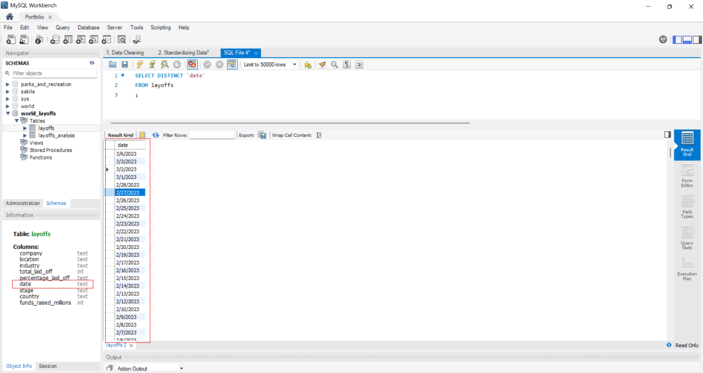
  *Before: Date is stored as text in MM/DD/YYYY format*

  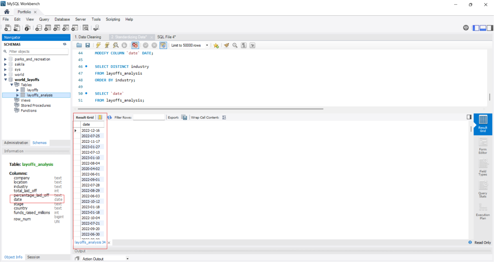
  *After: Date is converted to proper DATE format*

### 3. NULL & Blank Columns

Before doing the analysis, I handled NULL and blank values to ensure 
the data is clean and accurate. Here is what I did:

- Checked text columns for blank values. In some cases, two rows 
  belong to the same company but one has an industry value and the 
  other is blank. Where possible, I filled in the missing industry 
  based on the other row. If it cannot be determined, I converted 
  it to NULL
  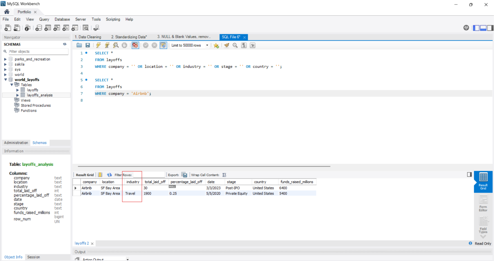
  *Before: Both companies are Airbnb but one industry is Travel and the other one is blank*

  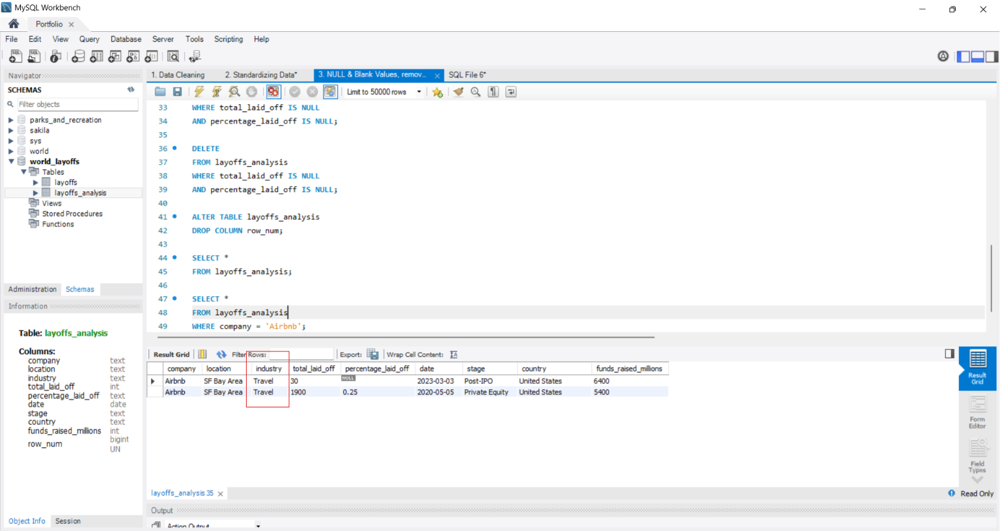
  *After: Airbnb industry is fixed
  
- Since this dataset is about global layoffs, companies with no 
  layoff data in both `total_laid_off` and `percentage_laid_off` 
  are not useful for analysis. I removed those rows entirely
- Dropped the `row_num` column as it was only needed for duplicate 
  detection and is no longer required
