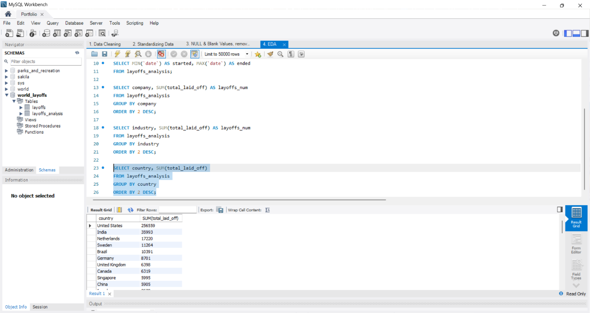
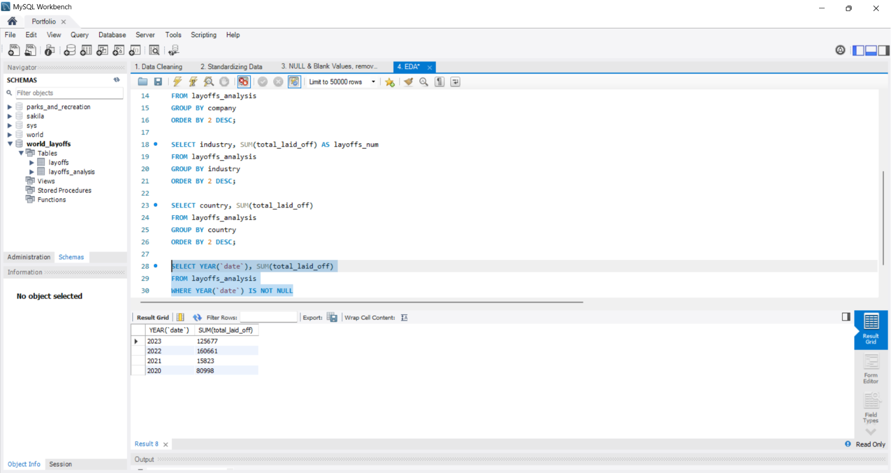
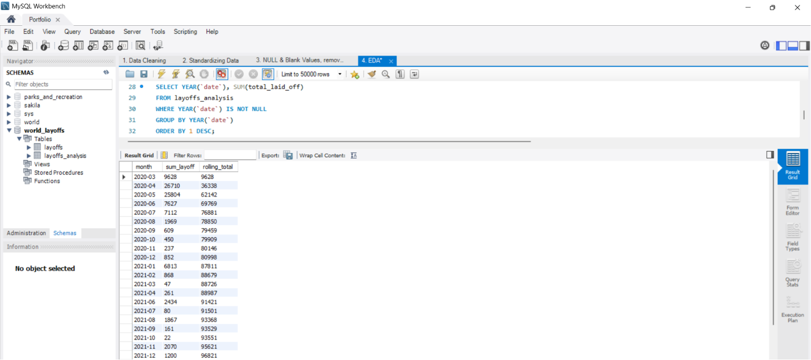
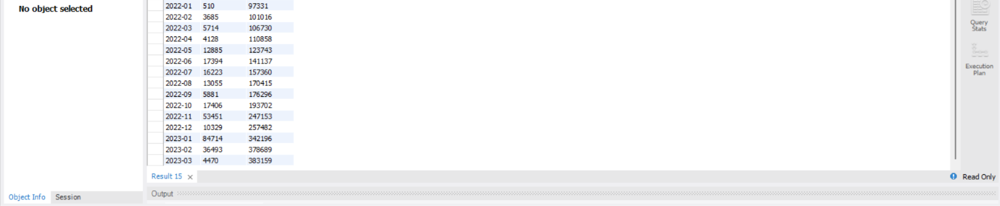
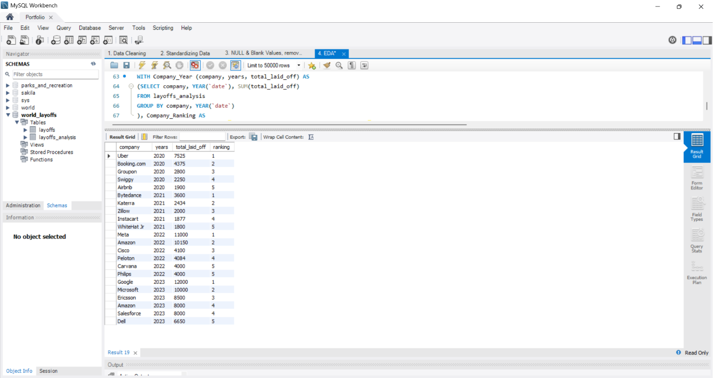

# World_Layoffs_Dataset
SQL analysis of global layoffs, exploring trends by company, industry, company stage, and geography using MySQL.

## Executive Summary

This analysis explores global layoff trends from 2020 to 2023, a 
period heavily shaped by the COVID-19 pandemic and its economic 
aftermath. Using a publicly available dataset, I looked at layoffs 
across companies, industries, countries and years to understand 
who was most affected and when.

Key findings show that the United States dominates global layoffs 
with **256,559** employees affected, driven largely by major tech 
companies such as Amazon, Google and Meta. While 2020 saw the 
initial shock of the pandemic, 2022 was the worst year overall 
with **160,661** layoffs, reflecting the correction after a period 
of over-hiring. The Consumer and Retail industries were hit the 
hardest, and layoff activity showed signs of slowing by 2023.

## Dataset Overview

The dataset covers global layoff events from 2020 to 2023, a period 
where many companies across different industries were affected by the 
COVID-19 pandemic and economic uncertainty. It includes information 
on the company, location, industry, funding stage, and how many 
employees were laid off.

However, since the dataset does not show the total number of employees,
percentage_laid_off is not really relevant because we cannot get the total 
number of employees for each company.

| Column | Description |
|---|---|
| `company` | Name of the company |
| `location` | City where the company is based |
| `industry` | Industry the company belongs to |
| `total_laid_off` | Number of employees laid off |
| `percentage_laid_off` | Percentage of workforce laid off |
| `date` | Date of the layoff event |
| `stage` | Company growth stage |
| `country` | Country where the company is based |
| `funds_raised_millions` | Total funds raised in millions |

The raw dataset used in this analysis can be downloaded [here](layoffs.csv).

## Analysis & Findings

### Layoffs by Company

The table below shows companies ranked by the highest number of 
employees laid off in a single event.

Google leads with the highest single layoff event at **12,000** 
employees, followed by Meta at **11,000** and Amazon appearing 
twice with **10,000** and **8,000** employees laid off in separate 
events. Most of the top companies are large tech firms, suggesting 
that despite their scale, they were not immune to workforce reductions 
during this period.

### Layoffs Period

The table below shows the time period covered in this dataset.

The earliest layoff recorded was on **2020-03-11** and the most recent 
was on **2023-03-06**. This confirms that the dataset covers the 
COVID-19 era, a period where many companies were forced to reduce 
their workforce due to economic uncertainty.

### Total Layoffs by Companies

Previously, we can see that some companies had more than one layoff 
event. The table below shows the total layoffs for each company.

From the previous table, Amazon appeared twice in layoff events. 
Looking at the total, Amazon laid off **18,150** employees in total, 
making it the highest among all companies. Google comes second with 
**12,000** and Meta at third with **11,000**. Not far behind are 
Salesforce, Microsoft and Philips with around **10,000** each.

### Total Layoffs by Industry

The table below shows the total number of layoffs by industry.

Consumer industry has the most layoffs with **45,182** employees affected. 
This makes sense since the top three companies with the highest layoffs, 
Amazon, Google and Meta, all come from the Consumer industry. Retail 
comes in second with **43,613**, not far behind. The Other category 
comes after with **36,289**.

### Total Layoffs by Countries

The table below shows the total number of layoffs by countries.

Five countries recorded over **10,000** employees impacted. United 
States is on top leaving other countries far behind with **256,559** 
employees affected. India comes second with only **35,993**. 
Netherlands at number three, Sweden fourth and Brazil fifth, with 
each having between **10,000** to **20,000** layoffs.

The dominance of the United States is not surprising given that it 
is home to the majority of the world's largest tech companies such 
as Google, Amazon and Meta, which we have already seen are among 
the top companies with the highest layoffs. The presence of India 
in second place reflects its large tech workforce, particularly in 
outsourcing and software development, making it heavily exposed 
when companies cut costs globally.

### Total Layoffs by Year

The table below shows the total number of layoffs by year. One record 
had a NULL date value and was excluded from this analysis.

**80,998** employees were affected in 2020, which was the starting year 
of this dataset. The number dropped significantly in 2021 with only 
**15,823**. This is likely because 2021 was a recovery year where 
governments rolled out stimulus packages and economies started reopening, 
allowing companies to stabilise after the initial COVID-19 shock.

However, 2022 became the worst year with **160,661** layoffs recorded. 
By this point, stimulus money had run out, interest rates were rising 
and tech companies that over-hired during 2020 and 2021 started 
correcting their workforce. In 2023, the number came down slightly 
to **125,677**, suggesting the worst may have passed but layoffs 
were still happening at a significant scale.

### Rolling Total of Layoffs by Month

The table below shows the monthly layoffs and the cumulative 
rolling total over time.

The rolling total started at **9,628** in March 2020 and grew 
steadily throughout the period. Layoff activity was relatively 
quiet through most of 2021, with some months recording fewer than 
**100** layoffs. The pace picked up significantly from mid 2022 
onwards, with the rolling total reaching **342,196** by January 
2023 and continuing to climb through the end of the dataset.

### Top 5 Companies with Most Layoffs per Year

The table below shows the top 5 companies with the highest layoffs 
for each year.

In 2020, the top companies were mostly from travel and hospitality 
such as Uber and Booking.com, which were directly impacted by 
COVID-19 travel restrictions. By 2022 and 2023, the list shifted 
heavily toward big tech companies like Meta, Amazon, Google and 
Microsoft, reflecting the large scale correction after a period 
of over-hiring during the pandemic.

## Conclusion

The data paints a clear picture of how external economic forces 
can impact workforce decisions at scale. The COVID-19 pandemic 
triggered an initial wave of layoffs in 2020, followed by a brief 
recovery in 2021 and a far worse correction in 2022 as companies 
dealt with the consequences of over-hiring and rising interest rates.

# Data Cleaning
Before doing the analysis, I performed data cleaning to ensure the 
dataset is accurate and ready for analysis. Below are the steps I took.

## Raw Data
- Below is a screenshot of raw data

### 1. Remove Duplicates

Since the dataset does not have a unique identifier, I needed to 
find another way to detect duplicates. Here is what I did:

- Created a staging table called `layoffs_analysis` to work on, 
  keeping the raw data untouched
- Used `ROW_NUMBER()` to flag duplicates by partitioning records 
  that share the same company, location, industry, total_laid_off, 
  date, stage, country, and funds_raised_millions
- Any record that appears more than once gets a row number greater 
  than 1 and those are the duplicates
- Deleted all records where row number is greater than 1
- After deleting, I ran the same query to check if any duplicates still exist. No results means the duplicates were successfully removed.

### 2. Standardizing Data

Checking data types is an important step before doing any analysis. 
Most of the time, raw data captures the `date` column as text instead 
of a proper date format, so that needs to be fixed. Here is what I did:

- Trimmed all text columns to remove any leading or trailing spaces 
  that could affect the analysis
- Some columns had inconsistent spellings for the same value, for 
  example `Crypto`, `Cryptocurrency` and `Crypto Currency` all refer 
  to the same industry. I standardized these so the data is consistent 
  and accurate
  
  *Before: Industry column with inconsistent spellings*
  
  
  *After: Standardized to a single value*
  
- Converted the `date` column from text to a proper DATE format so it 
  can be used correctly in time-based analysis
  
  *Before: Date is stored as text in MM/DD/YYYY format*

  
  *After: Date is converted to proper DATE format*

### 3. NULL & Blank Columns

Before doing the analysis, I handled NULL and blank values to ensure 
the data is clean and accurate. Here is what I did:

- Checked text columns for blank values. In some cases, two rows 
  belong to the same company but one has an industry value and the 
  other is blank. Where possible, I filled in the missing industry 
  based on the other row. If it cannot be determined, I converted 
  it to NULL
  
  *Before: Both companies are Airbnb but one industry is Travel and the other one is blank*

  
  *After: Airbnb industry is fixed*
  
- Since this dataset is about global layoffs, companies with no 
  layoff data in both `total_laid_off` and `percentage_laid_off` 
  are not useful for analysis. I removed those rows entirely
- Dropped the `row_num` column as it was only needed for duplicate 
  detection and is no longer required
